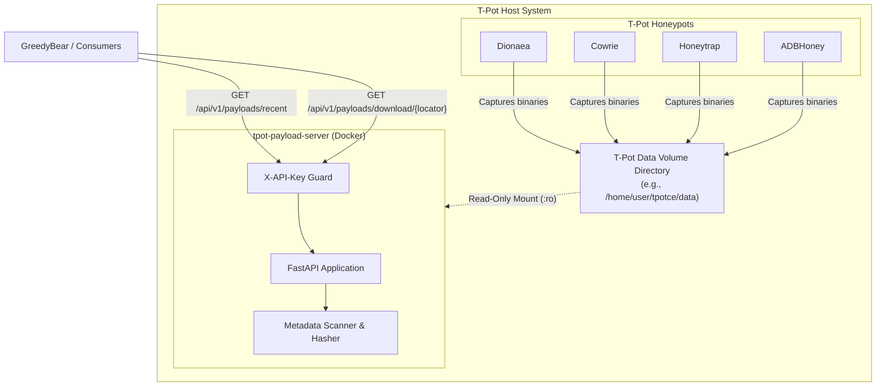

<p align="center"></p>

# T-Pot Payload Server

[](https://github.com/GreedyBear-Project/tpot-payload-server/stargazers)
[](https://github.com/astral-sh/uv)
[](https://github.com/astral-sh/ruff)

The **T-Pot Payload Server** is a lightweight, stateless FastAPI microservice designed to extract, inspect, and serve payload attack binaries captured by [T-Pot](https://github.com/telekom-security/tpotce) honeypots. Developed openly as part of the [GreedyBear](https://github.com/GreedyBear-Project/GreedyBear) ecosystem, it provides secure O(1) payload lookups, hash/metadata generation, and streaming downloads for automated ingestion by GreedyBear or external security research platforms.

---

## Architecture

The payload server runs as a containerized sidecar alongside T-Pot on the host machine. It mounts host honeypot capture directories as **read-only** volumes and exposes a secure REST API.



---

## Deployment

### Prerequisites

- **Docker** 20.10+ and **Docker Compose** v2.0+
- A running instance of **T-Pot CE** (or existing honeypot data directories on host)

### Quick Start

1. **Clone the repository:**
   ```bash
   git clone https://github.com/GreedyBear-Project/tpot-payload-server.git
   cd tpot-payload-server
   ```

2. **Configure environment variables:**
   Copy the example environment configuration into `docker/.env`:
   ```bash
   cp docker/.env.example docker/.env
   ```
   Open `docker/.env` and configure `TPOT_DATA_PATH` with the **absolute path** to T-Pot's data directory on your host:
   ```env
   TPOT_DATA_PATH=/home/user/tpotce/data
   ```

3. **Start the container:**
   ```bash
   docker compose -f docker/docker-compose.yml up -d
   ```

4. **Verify container health:**
   ```bash
   curl http://localhost:64444/health
   # Expected response: {"status":"ok"}
   ```

### Configuration Reference

All settings can be configured via environment variables in `docker/.env`:

| Environment Variable | Required | Default | Description |
| :--- | :---: | :---: | :--- |
| `TPOT_DATA_PATH` | **Yes** | *(None)* | **Absolute path** to T-Pot's data directory on the host system (e.g. `/home/user/tpotce/data` or `/data`). |
| `API_KEY` | No | *(Empty)* | Secret key for authenticating API requests via the `X-API-Key` header. When empty/unset, authentication is disabled. |
| `API_PORT` | No | `64444` | Host port mapped to the API service container. |
| `HONEYPOT_DIRS` | No | `dionaea/binaries,cowrie/downloads,honeytrap/downloads,adbhoney/downloads` | Comma-separated list of relative honeypot subdirectories to scan for payloads. |

---

## API Reference

The service exposes the following endpoints:

### `GET /health`
Returns the status of the payload server.

- **Response:** `200 OK`
  ```json
  {
    "status": "ok"
  }
  ```

---

### `GET /api/v1/payloads/recent`
Scans configured honeypot directories and returns metadata for payload files modified within the specified Unix timestamp window.

- **Query Parameters:**
  - `start_ts` (*float*, required): Start of modification time window (Unix timestamp, inclusive).
  - `end_ts` (*float*, required): End of modification time window (Unix timestamp, inclusive).
- **Headers:** `X-API-Key` (*string*, required if `API_KEY` is configured).
- **Response:** `200 OK` — List of `PayloadMetadata` objects.
  ```json
  [
    {
      "locator": "dionaea/binaries/0123456789abcdef0123456789abcdef",
      "mime_type": "application/x-dosexec",
      "md5": "e10adc3949ba59abbe56e057f20f883e",
      "sha1": "cdfbe90179257628a7e0a16a49591410884ef47a",
      "sha256": "f2ca1bb6c7e907d06dafe4687e579fce76b37e4e93b7605022da52e6ccc26fd2",
      "mtime": 1723000000.0,
      "size": 1048576,
      "source_honeypot": "dionaea"
    }
  ]
  ```
- **Error Responses:**
  - `403 Forbidden`: Missing or invalid `X-API-Key` header.
  - `422 Unprocessable Content`: Invalid timestamps (e.g., `start_ts > end_ts`).

---

### `GET /api/v1/payloads/download/{locator}`
Streams the raw binary payload file identified by its relative locator (obtained from `/recent`).

- **Path Parameters:**
  - `locator` (*string*, required): Relative file locator path (e.g. `dionaea/binaries/sample.bin`).
- **Headers:** `X-API-Key` (*string*, required if `API_KEY` is configured).
- **Response:** `200 OK` — `application/octet-stream` binary file stream.
- **Error Responses:**
  - `403 Forbidden`: Missing or invalid `X-API-Key` header.
  - `404 Not Found`: Payload file does not exist at locator path.
  - `422 Unprocessable Content`: Disallowed locator path (e.g., path traversal attempts).

---

## Interactive Documentation

FastAPI automatically generates interactive OpenAPI documentation:

- **Swagger UI:** Available at `http://<host>:<port>/docs`
- **ReDoc:** Available at `http://<host>:<port>/redoc`
- **OpenAPI Schema (JSON):** Available at `http://<host>:<port>/openapi.json`

---

## Authentication

Authentication uses header-based API key validation:

- **Header Name:** `X-API-Key`
- **Behavior:**
  - If `API_KEY` environment variable is set: All protected endpoints require a matching `X-API-Key` header.
  - If `API_KEY` environment variable is empty or unset: Authentication is disabled (designed for isolated internal network operation).

---

## Security Model

The server incorporates defense-in-depth mechanisms for safe handling of untrusted malware samples:

1. **Read-Only Volume Mounts:** Honeypot capture directories on the host are mounted into the container as **read-only** (`:ro`), preventing any file modification or deletion.
2. **Read-Only Container Filesystem:** Container execution specifies `read_only: true`, preventing write operations to root filesystems.
3. **Privilege Isolation:** Container runs with `no-new-privileges:true` and as a non-root user.
4. **Path Traversal Guards:**
   - Locator path components are strictly sanitized against `HONEYPOT_DIRS`.
   - Filenames are regex-validated against safe alphanumeric patterns (`^[A-Za-z0-9._-]+$`).
   - Path resolution verifies that target files reside inside `BASE_DATA_DIR` using `is_relative_to`, guarding against symlink traversal.
5. **Non-Executing Inspection:** File analysis calculates cryptographic hashes and MIME types via streaming read blocks without executing or loading sample code.

---

## Development

### Setup

We use `uv` for dependency management and `ruff` for linting and formatting.

1. **Install dependencies:**
   ```bash
   uv sync --all-groups
   ```

2. **Configure pre-commit hooks:**
   ```bash
   uv run pre-commit install -c .github/.pre-commit-config.yaml
   ```

3. **Run the test suite:**
   ```bash
   uv run pytest
   ```

4. **Lint and format code:**
   ```bash
   uv run ruff check
   uv run ruff format
   ```

---

## Sponsors and Acknowledgements

#### The Honeynet Project

<a href="https://www.honeynet.org">  </a>

[The Honeynet Project](https://www.honeynet.org) is an international non-profit security research organization dedicated to investigating cyber attacks and developing open-source security tools.

#### Google Summer of Code
<a href="https://summerofcode.withgoogle.com/">  </a>

This project was developed during the [Google Summer of Code](https://summerofcode.withgoogle.com/) (GSoC) program!

---

## Maintainers and Contributors

Special thanks to:
- [Tim Leonhard](https://github.com/regulartim) for mentoring and guiding the project architecture.
- [opbot-xd](https://github.com/opbot-xd) for all the contributions.

---

## How to Contribute

Head over to our [CONTRIBUTING](CONTRIBUTING.md) guide for details on submitting issues and pull requests.
